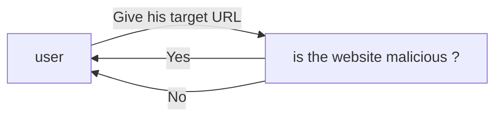
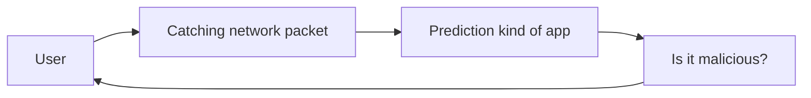

# architecture-cloud

## Overview
 1. [Initialization](#initialization)
 2. [Architecture](#Architecture)
 3. [Documentation](#Documentation)

## Initialization

first, you need to clone this git by typing in the terminal 
`git clone https://github.com/maaelle/architecture_network_analysis.git`.

Then, you have to register to AWS CLI, so type in the terminal `aws configure` and put your IAM key.

Once you finished to register to AWS CLI, you can type in the terminal `terraform init` and then `terraform apply`

> **Warning**
> don't use `terraform apply` for now because it's not finished

## Architecture

### Goal of our Project

The goal of our project is to protect the final user. 
So our project could be simplified by this bloc-schema below.

If the URL is malicious, so we send a warning to the user, otherwise we permit the direct access to the URL.

### The prediction

Our first idea was the prediction of all URL that all user wanted. 
It could work but all networks catching and predictions cost a lot of execution time, so it harms the final user 
who just wanted to be safe. We want the speediest system.

So we searched a solution to get to this problem.

### Saving old Predictions

So we add 2 databases to this architecture :

## Documentation

1. Redis et AWS : https://redis.com/blog/serverless-development-with-aws-lambda-and-redis-enterprise-cloud/
2. Redis et TF: https://developer.redis.com/create/aws/terraform/
