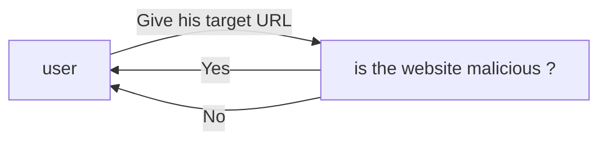
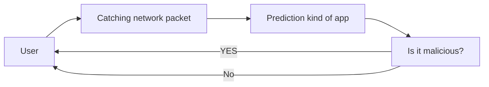
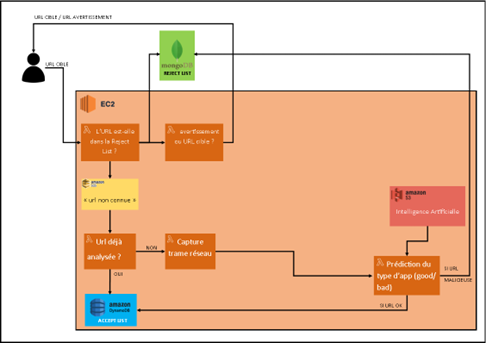
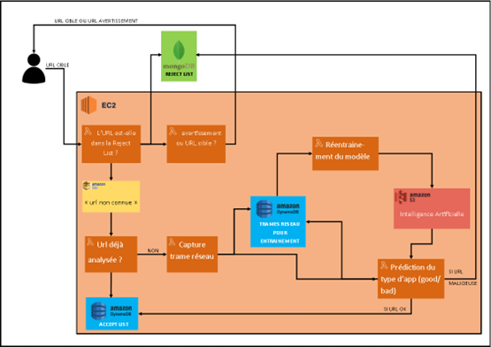
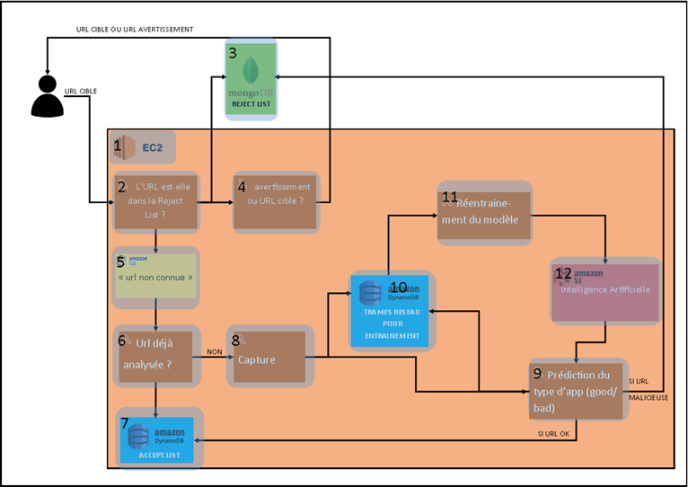

# architecture-cloud

## Overview

1. [Initialization](#initialization)
2. [How did we design our architecture?](#how-did-we-design-our-architecture)
    1. [Goal of our Project](#goal-of-our-project)
    2. [The prediction](#the-prediction)
    3. [Saving old Predictions](#saving-old-predictions)
    4. [Refitting our AI](#refitting-our-ai)
3. [Documentation](#documentation)

## Initialization

first, you need to clone this git by typing in the terminal
`git clone https://github.com/maaelle/architecture_network_analysis.git`.

Then, you have to register to AWS CLI, so type in the terminal `aws configure` and put your IAM key.

Once you finished to register to AWS CLI, you can type in the terminal `terraform init` and then `terraform apply`

> **Warning**
> don't use `terraform apply` for now because it's not finished

## How did we design our architecture?

The AI is in this [GitHub repository](https://github.com/clementreiffers/network_analysis).

### Goal of our Project

The goal of our project is to protect the final user.
So our project could be simplified by this bloc-schema below.

If the URL is malicious, so we send a warning to the user, otherwise we permit the direct access to the URL.

### The prediction

Our first idea was the prediction of all URL that all user wanted.
It could work but all networks catching and predictions cost a lot of execution time, so it harms the final user
who just wanted to be safe. We want the speediest system.
So we searched a solution to resolve this problem.

### Saving old Predictions

So we add 2 databases to this architecture as below:

This 2 databases serve to save to kind of data :

- the first one serve to store all rejected URL
- the second serve to store all accepted URL

This architecture permits to not predict 2 times the same URL, the user isn't harm by an execution cost provided by
the prediction and the network catching.

There is 2 ways for the user :

- If a URL is in the reject list, the user receive a warning.
- If a URL is not in the reject list, so the URL will fill an AWS SQS and will be verified by the AI in order to fill
  the databases, there is 2 ways for this URL:
    - If it has been accepted before, we analyse the next URL in the AWS SQS
    - If it has not been accepted before, so the URL is totally unknown, so it pass in the 2 lambdas seen before, so
      the network catching and the prediction. If the AI predicted this URL as a bad one, it fills the reject list
      otherwise it fills the accepted list.

This architecture save a lot of time for the user, but we need to improve continually our AI, we need refitting, so we
searched ways to improve this AI.

### Refitting our AI

To refitting the AI, we created this architecture below:

The AI will be refitted all along the utilization of the DNS. For that, we added an AWS dynamodb, which stores all
network packets from unknown URL.

### Detailed description of our architecture

| bloc | Description                                                                                                                                       |
|:----:|:--------------------------------------------------------------------------------------------------------------------------------------------------|
|  1   | All our architecture is in an AWS EC2, we will use all our AWS Lambda inside of it                                                                |
|  2   | We recuperate the target URL and verify if it has been rejected in the past. This lambda send a boolean                                           |
|  3   | It represents our reject list in mongodb. it's outside the EC2 because it's hosted by mongo atlas                                                 |
|  4   | It send a warning if the bloc 2 send "false" otherwise it send the target URL to the user                                                         |
|  5   | This is an AWS SQS of all URL which aren't in the reject list                                                                                     |
|  6   | This lambda verify if the URL is in the accepted list                                                                                             |
|  7   | This bloc represents the AWS dynamodb used to store all accepted URL.                                                                             |
|  8   | This lambda listen the network and will compute a GET HTTP to the target URL. It catches network packets                                          |
|  9   | This lambda is our AI. It predicts the network packets received from bloc 8, predicts the kind of app and fills reject/accept list in consequence |
|  10  | This bloc represents cache used to refit our AI. It will be empty once the refitting finished.                                                    |
|  11  | It refits the AI with data from bloc 10                                                                                                           |
|  12  | It store the AI used for predictions and refitting.                                                                                               |

## Documentation

1. Redis et AWS : https://redis.com/blog/serverless-development-with-aws-lambda-and-redis-enterprise-cloud/
2. Redis et TF: https://developer.redis.com/create/aws/terraform/
