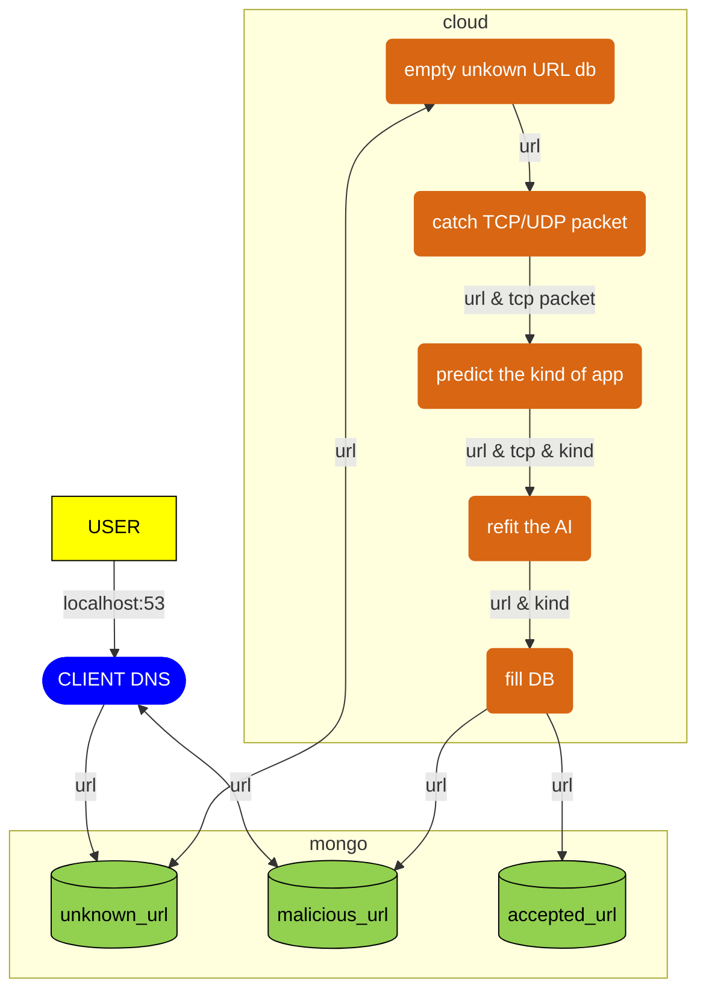
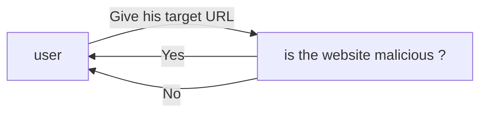
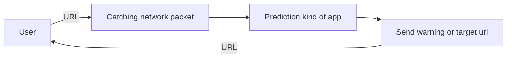
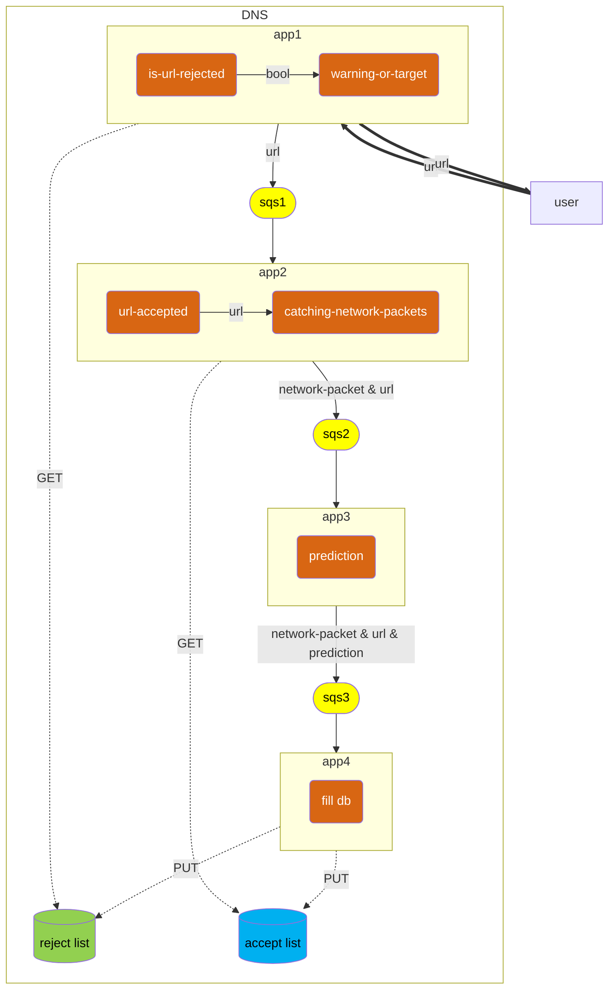
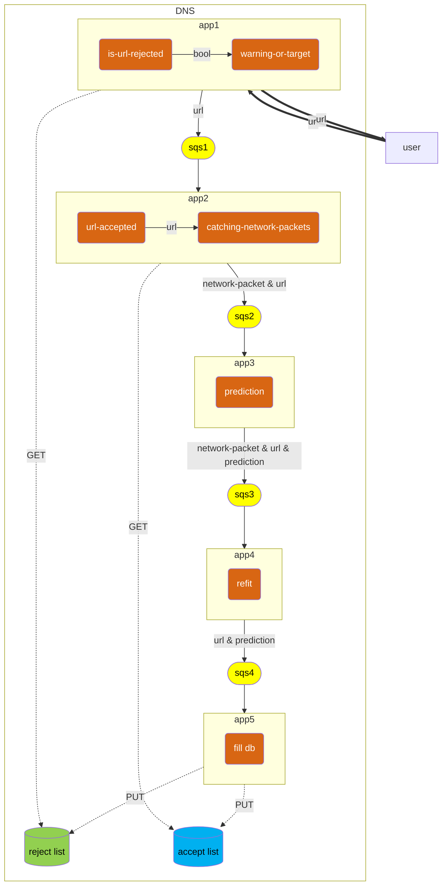

# architecture-cloud

This GitHub Repository describes how we want to protect all users from navigating on internet.
So we decided to create a DNS server which works thanks to an AWS server.

This Readme explains how to create this server using terraform, and how it works and why we decided this configuration.

## Overview

1. [Installation](#installation)
2. [Architecture](#architecture)
    1. [General Schema](#general-schema)
3. [How did we design our architecture?](#how-did-we-design-our-architecture)
    1. [Goal of our Project](#goal-of-our-project)
    2. [The prediction](#the-prediction)
    3. [Saving old Predictions](#saving-old-predictions)
    4. [Refitting our AI](#refitting-our-ai)
4. [Links](#links)

## Architecture

Our final architecture can be resumed into 5 different apps connected to 2 databases.
If you want any details about how we designed our system, see the topic 
[How did we design our architecture?](#how-did-we-design-our-architecture).

### General schema

the graph above describes how our solution works.

First we have created a CLI app [hosted here](https://github.com/clementreiffers/dns-server), this app 
once installed, will ask you which dns server do you want, and if you choose `127.0.0.1`, your entire 
OS will use this DNS server.

If the OS use this DNS server, so the CLI app, it will listen which URL you consult and fill databases with it, 
in respect of RGPD laws. We only recuperate the URLs in order to prevent people from bad URLs using AI.

the cloud part, is divided into 5 parts.

The first part is triggered automatically n times per hours, it served only to empty the mongodb database, and 
then fill an SQS to be processed after.

The second part, catch the TCP packet of the related URL if it is possible and fill an SQS to be analyzed by an AI.

the third part, predicts the kind of app using AI, and the fourth part refit this AI with its prediction.

the final part fill the mongo database with url depending if the url is malicious or not.

## Installation

First, you need to clone this git by typing in the terminal
`git clone https://github.com/maaelle/architecture_network_analysis.git`

Then, you have to register to AWS CLI, so type in the terminal `aws configure` and put your IAM key.

Once you finished to register to AWS CLI, you can type in the terminal `terraform init` and then `terraform apply`

> **Warning**
> don't use `terraform apply` for now because it's not finished

## How did we design our architecture?
> **Note**
> The AI is available in this [GitHub repository](https://github.com/clementreiffers/network_analysis).

### Goal of our Project

The goal of our project is to protect the final user.
So our project could be simplified by this flowchart below :

If the URL is malicious, so we send a warning to the user, otherwise we permit the direct access to the URL.

### The prediction

Our first idea was the prediction of all URL that all user wanted.
It could work but all networks catching and predictions cost a lot of execution time, so it harms the final user
who just wanted to be safe. We want the fastest system.
So we searched a solution to resolve this problem.

### Saving old Predictions

So we add 2 databases to this architecture as below:

This 2 databases serve to save two kind of data :

- the first one serves to store all rejected URL
- the second serves to store all accepted URL

This architecture permits to not predict 2 times the same URL, the user isn't harm by an execution cost provided by
the prediction and the network catching.

This architecture save a lot of time for the user, but we need to improve continually our AI, we need refitting, so we
searched ways to improve this AI.

### Refitting our AI

To refitting the AI, we created this architecture below:

The AI will be refitted all along the utilization of the DNS. For that, we added an AWS dynamodb, which stores all
network packets from unknown URL.

## the CLI app

In order to reduce the consumption of resources on cloud and permit all people to have good performance, 
we decided to create a CLI app, which manages the listening and the management of the user directly in his OS.
To see how it has been refactoring, see the [General Schema](#general-schema)

## Links

### AWS

1. [AWS lambda](https://aws.amazon.com/fr/lambda/)
2. [AWS SQS](https://aws.amazon.com/fr/sqs/)
3. [AWS S3](https://aws.amazon.com/fr/s3/)
4. [AWS dynamodb](https://aws.amazon.com/fr/dynamodb/)
5. [AWS EC2](https://aws.amazon.com/fr/ec2/)

### Databases
1. [Mongodb](https://www.mongodb.com/fr-fr)
2. [AWS dynamodb](https://aws.amazon.com/fr/dynamodb/)

### Terraform
1. [Terraform](https://www.terraform.io/)

### Contributors

Clément Reiffers:
- @clementreiffers
- <https://github.com/clementreiffers>

Maelle Marcelin:
- @maaelle
- <https://github.com/maaelle>

Camille Bayon de Noyer:
- @Kamomille
- <https://github.com/kamomille>

Sonia Moghraoui:
- @SoniaMogh
- <https://github.com/SoniaMogh>

 
