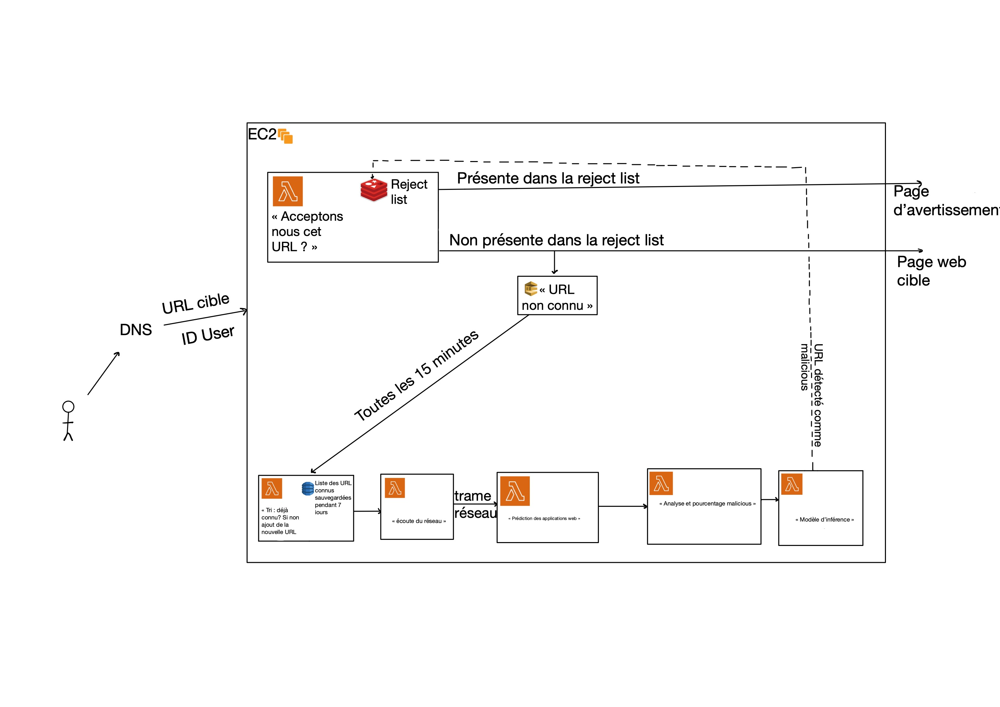

Sommaire : 
 1. [Initialisaition](#init)
 2. [Architecture](#archi)
 3. [Documentation](#doc)


Initialiser le projet <a name="init"></a>

1. cloner le git 
2. ’’’ aws configure ’’’
3. rentrer les key IAM
4. terraform init


```diff
- !!!!!!!!!!! ATTENTION ne pas appliquer de terraform apply sur ce projet pour l'instant
```

Schéma <a name="archi"></a>

 


Documentation <a name="doc"></a>

1. Redis et AWS : https://redis.com/blog/serverless-development-with-aws-lambda-and-redis-enterprise-cloud/
2. Redis et TF: https://developer.redis.com/create/aws/terraform/
